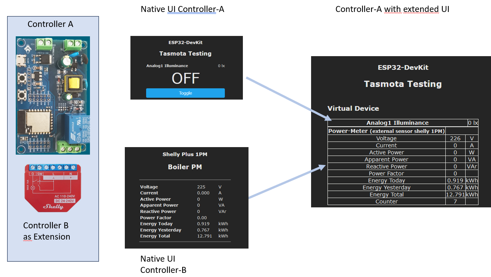

# Berry-ExtSensor

A Berry example application for including sensors of remote tasmota controllers.


## Motivation

I'm currently dealing  with a controller, that is supposed to control a heating cartridge for a boiler.

For safety reasons (boiler temperature sensor) a galvanic isolation is required. 

Unfortunately is the 'Shelly Plus 1PM'- Addon not available with Tasmota.

This gave rise to the idea of ​​augmenting a specific device with information from remote sensors.

It should merge the sensor-data


and also the UI-elements



## Different Scenes

After start of application without any sensors


After installing of the application


The UI-field 'Message Counter' increments each time a sensor message is received from the external controller.

## How to install

Preparation of the external device
- a Shelly Plus 1PM is as external device assumed
- install the [UdpBroker-app](https://github.com/wjohn007/Berry-UdpBroker)
- ...

Prepare the device to be extended
- upload following files to to the tasmota-controller
    - ExtSensor.app
    - ExtSensor01.be
    - ExtSensor02.be
  
- Restart the controller


### Enable/disable enrichment of the sensor message tele/.../SENSOR

```be
    extSensor.enableSensorMsg=true
```

If 'enableSensorMsg' is activated then the sensor messages will be extended like

```json
{
	"Time": "2024-01-17T19:27:01",
	"ENERGY": {
		"Period": 0,
		"Total": 14.37,
		"Current": 0,
		"Yesterday": 1.019,
		"Today": 0.56,
		"TotalStartTime": "2023-11-16T17:20:56",
		"ReactivePower": 0,
		"Voltage": 225,
		"ApparentPower": 0,
		"Factor": 0,
		"Power": 0
	}
}    
```

### More Information

Take a look to file [ExtSensor02.be](ExtSensor02.be) and see how

- data are obtained from remote controller
- data are prepared
- data are linked to UI
